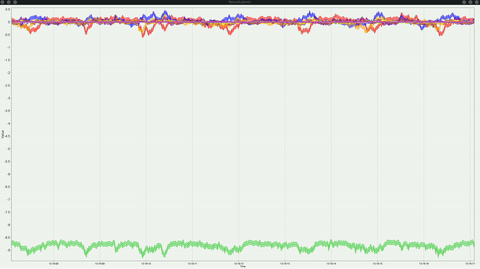

# Estimating Parameters of Kalman Filter

In the following example, you will see how the `Bonsai.ML.Lds.Torch` package can be used to estimate the parameters of a Kalman filter and perform acausal smoothing of neural spike counts.

### Download the Dataset

To run the example, you need to download the dataset from DANDI and transform the raw spike data into binned spike counts. We provide a convenient python script and `uv` environment to easily download and transform the raw data. First, make sure `uv` is installed on your computer, which you can do by following the guide [here](https://docs.astral.sh/uv/getting-started/installation/).

Next, open up a terminal and run the following commands.

```bash
cd examples/Torch.LDS/NeuralLatents/EstimatingParameters
uv run download_data.py
```

When the script finishes, you should see 2 different datasets saved, one for training and the other for testing.

### Running the Workflow

The example workflow is shown here:

:::workflow

:::

The first group node, `LoadData`, loads the training dataset and converts it into a `Tensor` object. It then reshapes it so that the dimensions are `time` x `neurons` and passes it to a `ReplaySubject` called `SpikeCounts` to be used in the downstream processing pipeline. In this example, the entire batch of data are loaded. 

The `LoadModel` group node uses the `CreateKalmanFilter` node to specify the model. We leave the optional parameters blank. We set the `NumStates` to `10` and the `NumObservations` to `142` to match the number of spiking neurons contained in the dataset. This then feeds into a `BehaviorSubject` node called `KalmanFilterModel` for use in other parts of the workflow.

In the `LearnParameters` group node, the `SpikeCounts` are fed into the `ExpectationMaximization` node which uses the EM algorithm to iteratively optimize the models selected parameters given the spike count data. The EM algorithm will iterate until it reaches the `MaxIterations` count or until the algorithm converges to less than the `Tolerance`. After some time, the algorithm will finish and the output will be passed to a `BehaviorSubject` called `ExpectationMaximizationResult` to trigger the inference procedure.

The last group node, `InferNeuralLatents`, contains the inference pipeline and starts when the `ExpectationMaximizationResult` is emitted. The `Filter` step runs causal filtering over the entire batch of `SpikeCounts`. The `UpdatedFilterResult` is then run through the `Smooth` step, which runs acausal smoothing from the last data point all the way back to the initial data point. This `UpdatedSmoothedResult` is then fed into the `Orthogonalize` node, which essentially node extracts the principal, orthogonal components of the measurement function and projects the state mean and covariance into the orthogonalized space to focus only on the most informative directions. The `OrthogonalizedResult` is then decomposed into individual observations over time and gated to produce values at a frequency of a ~100Hz.

When you start the workflow, you should see a window pop up with the title `NeuralLatents`. As the EM algorithm runs, nothing will be displayed at first. After 10 iterations, the EM algorithm will finish, and once the data are filtered, smoothed, and orthogonalized, you will start to see the inferred latents displayed in the chart. This is how it should appear:


