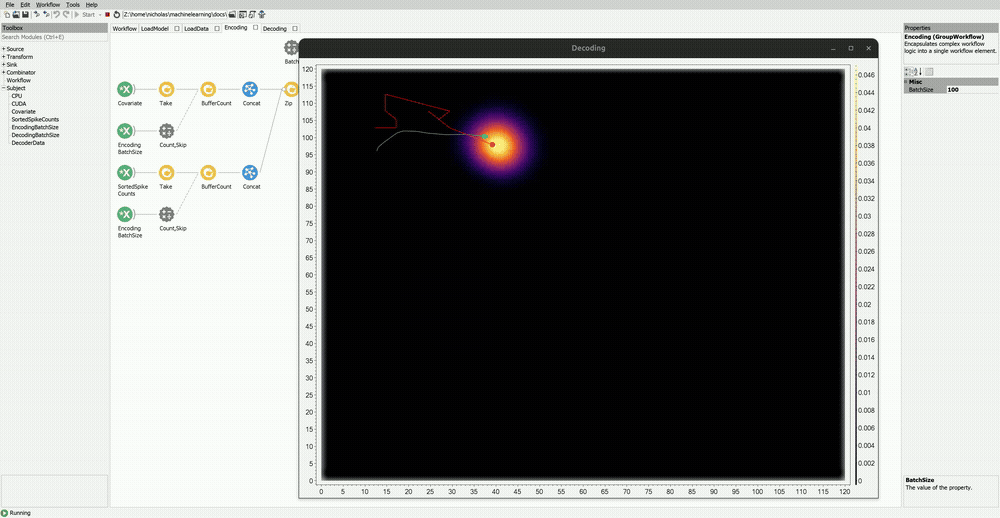

# Decoding Position from Hippocampus with Sorted Spike Counts

In the following example, the `Bonsai.ML.PointProcessDecoder` package is used to decode an animals position during a spatial navigation task using sorted spike counts from tetrode recordings of hippocampal neurons.

### Dataset

The data for this example was generously provided by the authors of "Joshi, A., Denovellis, E.L., Mankili, A. et al. (2023). Dynamic synchronization between hippocampal representations and stepping. Nature, 617, 125–131." [https://doi.org/10.1038/s41586-023-05928-6](https://doi.org/10.1038/s41586-023-05928-6). If you found this example useful, please consider citing their work.

You can download the `HippocampalTetrodeRecordings.zip` dataset here: [https://doi.org/10.5281/zenodo.10629221](https://doi.org/10.5281/zenodo.10629221). Only 2 of the 3 binary data files are needed for this example: the `position.bin` file contains 2D tracking position of the animals nose position detected using [DeepLabCut](https://deeplabcut.github.io/DeepLabCut/README.html), and the `spike_counts.bin` file contains spike counts from 104 spike sorted units detected using [MountainSort](https://github.com/LorenFrankLab/franklab_mountainsort_old). Once downloaded, you will need to extract the contents of the zip file into the `datasets` folder. The workflow expects both the `position.bin` and `spike_counts.bin` to be in the folder path `datasets/HippocampalTetrodeRecordings/`.

### Workflow

Below is the example workflow.

:::workflow

:::

#### Load Model

The `LoadModel` group workflow contains nodes for defining the model and initializing the `Torch` library. The `InitializeTorchDevice` nodes are apart of the `Bonsai.ML.Torch` library and define which computing device will be used for execution. The `CPU` and `CUDA` devices are used to initialize the CPU and GPU, respectively. It is highly recommended to use a GPU for real-time decoding. However, for the purposes of the demo, it is possible to use only the CPU by simply changing the `DeviceType` property to `CPU` for the node upstream of the `CUDA` subject. The `CUDA` device object is passed to the model's `Device` property and we give the model the default name.

In this example, the mouse's position is decoded from neural activity while it navigates a W-shaped track during a spatial alternation task. The coordinates of the mouse lie in the range [0, 120] for both the x and y dimension. Thus, the `MinRange` and `MaxRange` values are set to `0, 0` and `120, 120`, respectively. The `Dimensions` are set to `2` and the `Steps` parameter is set to `50, 50`. The `Bandwidth` is set to `10, 10`.

The neural data consists of pre-sorted spike counts from tetrode recordings taken from the hippocampus. Thus, the `SortedSpikes` encoder is used. The dataset includes 104 sorted units, so the `NUnits` property is set to `104`. The `EstimationMethod` is set to `KernelCompression` and the `DistanceThreshold` is set to `1.5`.

The `StateSpaceDecoder` type is used with `RandomWalk` transitions. The `SigmaRandomWalk` is set to `1`.

#### Load Data

The `LoadData` group node contains nodes for loading the data and converting them to `Tensor` objects which are used by the model. The `MatrixReader` nodes load in the binary data files into `Mat` objects. These objects are then converted to `Tensor` objects and subsequently processed and formatted into the correct type and shape. These data are then sent to the `Covariate` and `SortedSpikeCounts` subjects, respectively.

#### Encoding

In the `Encoding` group, the `Covariate` and `SortedSpikeCounts` data are batched into chunks based on the value of `EncodingBatchSize`, which is set to `100`. The data are then combined using `Zip` to produce a `Tuple<Tensor, Tensor>` object. The `Tuple<Tensor, Tensor>` object is then passed to the `Encode` node.

#### Decoding

In the `Decoding` group, only the `SortedSpikeCounts` data are passed to the `Decode` node. The `SortedSpikeCounts` are batched into chunks using the value of `DecodingBatchSize`, set to `10`. Notice that the `DecodingBatchSize` does not need to be the same as the `EncodngBatchSize`. The output of `Decode` is a `Tensor` object corresponding to the posterior distribution evaluated over the covariate range. The posterior tensor object is passed to the `GetDecoderData` node, which returns a `DecoderData` struct containing useful properties of the posterior.

Both the `Covariate` position data and `MaximumAPosterioriEstimate` of the posterior are converted to `Point2d` objects and overlaid onto the `PosteriorVisualizer` using externalized `VisualizerMapping` nodes.

#### Demo

To visualize the posterior output, simply open the `Decoding` node's visualizer. This will display a posterior heatmap visualizer with the animal's `TruePosition` (green) as well as the `MaximumAPosterioriEstimate` (red) overlaid. You can change properties of the visualizer by right clicking the window, and selecting the `Visualizer Properties` drop down menu.

In the example, the model's predictions at the start will be inaccurate. As the model encodes more data over time, it becomes increasingly better at predicting the covariate data. Here is how it will look after encoding 50000 data points:

