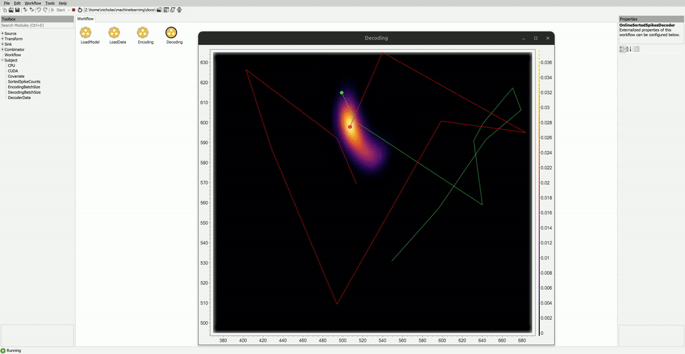

# Decoding Position from Striatum with Sorted Spike Counts

In the following example, the `Bonsai.ML.PointProcessDecoder` package is used to decode an animal's head position during a procedural memory task using sorted spike counts from Neuropixel recordings of striatum.

### Dataset

The data for this example was generously provided by the authors of "Thompson, E., Rollik, L., Waked, B. et al. (2024). Replay of procedural experience is independent of the hippocampus. bioRxiv, 2024.06.05.597547." If you found this example useful, please consider citing their work.

You can download the `StriatalNeuropixelRecordings.zip` dataset here: [https://doi.org/10.5281/zenodo.10629221](https://doi.org/10.5281/zenodo.10629221). It consists of 2 binary data files: the `position.bin` file contains 2D tracking coordinates of the animal head position detected using [DeepLabCut](https://deeplabcut.github.io/DeepLabCut/README.html), and the `spike_counts.bin` file contains the spike counts from 564 spike sorted units detected using [KiloSort](https://github.com/MouseLand/Kilosort). Once downloaded, you will need to extract the contents of the zip file into the `datasets` folder. The workflow expects both the `position.bin` and `spike_counts.bin` to be in the folder path `datasets/StriatalNeuropixelRecordings/`. The position and spiking data have been processed in this example to only include segments where the animal is actively engaged in the task.

### Workflow

Below is the example workflow.

:::workflow

:::

#### Load Model

The `LoadModel` group workflow contains operators for defining the model and initializing the `Torch` library. The `InitializeTorchDevice` operator is part of the `Bonsai.ML.Torch` library and specifies which computing device will be used for execution. The `CPU` and `CUDA` devices are used to initialize the CPU and GPU, respectively. It is highly recommended to use a GPU for real-time decoding. However, for the purposes of the demo, it is possible to use only the CPU by simply changing the `DeviceType` property to `CPU` for the operator upstream of the `CUDA` subject. The `CUDA` device object is passed to the model's `Device` property and we give the model the default name.

In this example, the goal is to decode the animal's tracked heading position while it is engaged in a procedural memory task performing nose pokes into a grid of buttons. The buttons reside within the field of view of the camera roughly between [370, 690] and [495, 635] along the x and y dimensions, respectively. Thus, the `MinRange` and `MaxRange` values are set to `370, 495` and `690, 635` accordingly. The `Dimensions` are set to `2` and the `Steps` parameter is set to `50, 50`. The `Bandwidth` is set to `15,15`.

The neural data consists of pre-sorted spike counts from Neuropixel recordings taken from the striatum. Thus, the `SortedSpikes` encoder is used. The dataset includes 564 sorted units, so the `NUnits` property is set to `564`. The example has been tested on an Nvidia RTX 3080 Ti mobile GPU with 16GB of memory, so the `KernelLimit` is set to `20000`, which stabilizes around 15GB of memory usage. This value should be changed depending on your system requirements. The `EstimationMethod` is set to `KernelCompression` and the `DistanceThreshold` is set to `1.5`.

The `StateSpaceDecoder` type is used with `RandomWalk` transitions. The `SigmaRandomWalk` is set to `10`.

#### Load Data

The `LoadData` group contains operators for loading the data and converting them to `Tensor` objects which are used by the model. The `MatrixReader` operators load in the binary data files into `Mat` objects. These objects are then converted to `Tensor` objects and subsequently processed and formatted into the correct type and shape. These data are then sent to the `Covariate` and `SortedSpikeCounts` subjects, respectively.

#### Encoding

In the `Encoding` group, the `Covariate` and `SortedSpikeCounts` data are batched into chunks based on the value of `EncodingBatchSize`, which is set to `1000`. The data are then combined using `Zip` to produce a `Tuple<Tensor, Tensor>` object. The `Tuple<Tensor, Tensor>` object is then passed to the `Encode` operator.

#### Decoding

In the `Decoding` group, only the `SortedSpikeCounts` data are passed to the `Decode` operator. The `SortedSpikeCounts` are batched into chunks using the value of `DecodingBatchSize`, set to `10`. Notice that the `DecodingBatchSize` does not need to be the same as the `EncodingBatchSize`. The output of `Decode` is a `Tensor` object corresponding to the posterior distribution evaluated over the covariate range. The posterior tensor object is passed to the `GetDecoderData` operator, which returns a `DecoderData` struct containing useful properties of the posterior.

Both the `Covariate` position data and `MaximumAPosterioriEstimate` of the posterior are converted to `Point2d` objects and overlaid onto the `PosteriorVisualizer` using `VisualizerMapping` operators.

#### Demo

To visualize the posterior output, simply open the visualizer of the `Decoding` operator. This will display a posterior heatmap visualizer with the animal's `TruePosition` (green) as well as the `MaximumAPosterioriEstimate` (red) overlaid. You can change properties of the visualizer by right clicking the window, and selecting the `Visualizer Properties` drop down menu.

In the example, the model's predictions at the start will be inaccurate. As the model encodes more data over time, it becomes increasingly better at predicting the covariate data. Here is how it will look after encoding 10000 data points:

